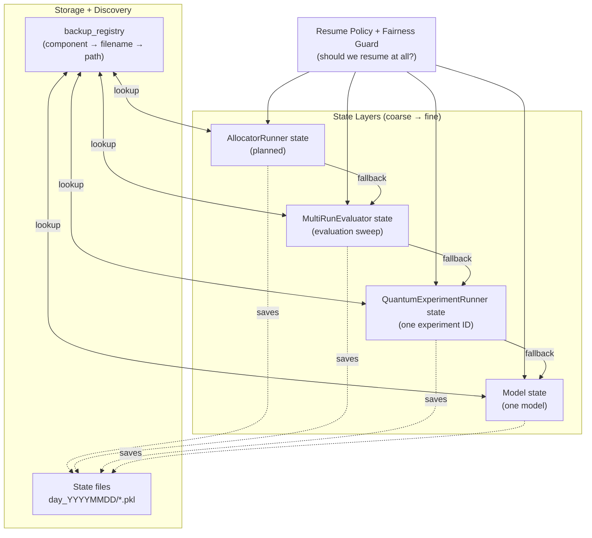

# State Layers & Resume Strategy

This framework is intentionally designed with **multiple independent state layers** so we can resume work at the right granularity after interruptions (including across days) and so downstream analysis can trust what was executed.

## Goal (why multiple layers exist)

We save state at three levels (and soon four):

1. **Model state**: resume a *single model* run.
2. **Runner state**: resume an *entire experiment* (one experiment ID / scenario) that contains multiple models.
3. **Evaluator state**: resume an *evaluation sweep* (multiple experiments/runs across scenarios).
4. **AllocatorRunner state (planned)**: resume an *allocator-level orchestration* that contains multiple evaluators and supports “whole allocator” analysis.

The idea is that if an evaluator run is interrupted, we can resume tomorrow at the **most appropriate layer**:
- Fastest path: resume evaluator/runner if compatible.
- Most granular fallback: resume individual models when the higher layers are incomplete/unavailable.

## Mental model (narrative that guides design decisions)

Use this story to sanity-check responsibilities before changing code.

- **Configuration (`configs`) = “the sun”**: shared context seen by every object, but **no single object owns it**.
- **Allocator = “a world”**: defines routing/qubit-allocation conditions; worlds differ.
- **Threat scenarios = “shared aerospace”**: the same scenario suite must be flown through every world so comparisons stay fair.
- **Evaluator = “a continent”**: evaluates and aggregates performance across its countries (experiments) under one scope (testbed/allocator/scales/scenarios/horizon).
- **Runner = “a country”**: one concrete experiment instance; it must be consistent for every worker inside it.
- **Models = “workers”**: algorithms that operate inside the same country; they must experience the **same environment instance** for fairness.

**Design question for any change (mandatory):**
> Which owner (world/continent/country/worker) should own this behavior, and what fairness contract must it preserve?

## The state layers (coarse → fine)

### 1) Model state (`model_state/…`)
- **Purpose**: Resume an individual algorithm/model (e.g., `EXPNeuralUCB`, `GNeuralUCB`, `Oracle`, etc.).
- **When used**: When runner/evaluator state is missing/incomplete, or when we want fine-grained continuation.
- **Trade-off**: This can change the semantics of a “fresh” experiment (important for fairness-sensitive studies). Sometimes we explicitly **disable** resume to avoid contaminating fairness comparisons.

### 2) Runner state (`framework_state/QuantumExperimentRunner_…`)
- **Purpose**: Resume an experiment (one experiment ID) that includes multiple models.
- **When used**:
  - Continue a partially completed experiment without rerunning completed models.
  - Reconstruct missing runner results by re-running only what’s missing.
- **Key property**: Runner-level resume is the “experiment integrity” layer.

### 3) Evaluator state (`framework_state/MultiRunEvaluator_…`)
- **Purpose**: Resume the evaluation sweep across experiments and scenarios.
- **When used**:
  - Continue long evaluations without rerunning completed experiments.
  - Recover from notebook/kernel interruptions and still produce consistent summaries/plots.
- **Key property**: Evaluator-level resume is the “study progress” layer.

### 4) AllocatorRunner state (`framework_state/AllocatorRunner_…`) — planned
- **Purpose**: Track and resume *allocator-centric orchestration*.
- **Why it matters**: This layer has access to **all evaluators run under an allocator**, which makes analysis more comprehensive and reproducible (allocator ↔ evaluator ↔ runner ↔ model).

## Resume ladder (how we should think about resuming)

At run time, resumption should behave like a ladder:

1. Try **AllocatorRunner** state (when implemented).
2. Else try **Evaluator** state.
3. Else try **Runner** state.
4. Else try **Model** state.
5. Else run fresh.

This preserves the principle: **resume as high as possible, fall back as needed**.

## Resume scope controls (Drive-aware)

Resume can be expensive when most state has been offloaded to Drive. To keep resume fast and predictable, the framework supports a **scope** knob.

- `DAQR_RESUME_SCOPE`
  - `evaluator` (default): only restores evaluator state (`framework_state/MultiRunEvaluator_*`) unless an explicit downstream state is requested.
  - `all`: enables full restore/prefetch behavior (runner + model states) when resuming from an evaluator.
- `DAQR_RESUME_ALLOW_DRIVE_DOWNLOADS`
  - `1` (default): allow lazy Drive downloads when a needed state file is missing locally.
  - `0`: disable Drive downloads (resume only uses local files).

Notes:
- `DAQR_RESUME_SCOPE=all` is still available when you explicitly want full restore behavior.
- Analysis tooling (`state_analysis.py`) now uses the same Drive manager implementation to prefetch missing `MultiRunEvaluator_*` evaluator pickles when building master datasets.

## Responsibility guardrails (keep code short + reusable)

- Keep “state discovery” inside the owning object (constructor/resume path + its own methods).
- Don’t duplicate filename/registry probing logic in unrelated layers.
- Treat `configs` as shared context; avoid mutations that change other objects’ intended contracts.
- When changing saved evaluator payload, preserve the consumer contract documented in `docs/guides/STATE_ANALYSIS_EVALUATOR_CONTRACT.md`.

## Registry is the heart of resume

States live in dated folders (e.g., `day_YYYYMMDD`). To reliably discover them later, we rely on a registry mapping:
- `component` → `filename` → `absolute path`

If the registry is stale (not updated after saves), the system can behave like:
> “file exists locally, but resume can’t find it”

That’s why the registry must be **updated and persisted after each evaluator/runner/model save**, so the next run (or next day) can recover correctly.

## Fairness note (why we sometimes *don’t* resume)

Resume can be a big time-saver, but it can also change experimental semantics:
- Continuing a learned policy can bias fairness measurements vs a clean re-run.
- Some studies need strict “start-from-scratch” behavior for comparability.

So resume is a tool, not a default: **we decide per study** whether resume is allowed.

## Diagram (state hierarchy + fallback)

## Confirmed Resume Defect — Paper 7 evaluator state contamination (2026-03-07)

### Scope

This finding is limited to the Paper 7 evaluator resume failure reported from:

- `hybrid_variable_framework/Dynamic_Routing_Eval_Framework/daqr/config/framework_state/day_20260307/MultiRunEvaluator_50-Default_All_All-50_50_5_S1T_paper7.pkl`

The failure is raised by `MultiRunEvaluator.__eq__` during evaluator resume comparison in:

- `hybrid_variable_framework/Dynamic_Routing_Eval_Framework/daqr/evaluation/multi_run_evaluator.py`

### Runtime symptom

The active run reports a 4-path Paper 7 allocation, while the loaded evaluator state reports a 15-path allocation:

- Current runtime `qubit_capacities`: `(9, 9, 9, 8)`
- Loaded saved `qubit_capacities`: `(5, 6, 4, 6, 4, 6, 4, 6, 4, 6, 4, 6, 4, 6, 4)`

This causes evaluator equality/resume to reject the saved state as incompatible.

### Verified on-disk evidence

The mismatch is real and is not limited to the comparison printout.

#### 1) Current saved evaluator (`day_20260307`)

Direct inspection of:

- `hybrid_variable_framework/Dynamic_Routing_Eval_Framework/daqr/config/framework_state/day_20260307/MultiRunEvaluator_50-Default_All_All-50_50_5_S1T_paper7.pkl`

shows:

- `key_attrs['qubit_capacities'] = (5, 6, 4, 6, 4, 6, 4, 6, 4, 6, 4, 6, 4, 6, 4)`
- `runner_qubit_caps['stochastic']['1'..'5'] = same 15-path tuple`
- `runner_qubit_caps['none']['1'..'5'] = same 15-path tuple`
- `runner_qubit_caps['markov']['1'..'5'] = same 15-path tuple`
- `runner_qubit_caps['adaptive']['1'..'5'] = same 15-path tuple`
- `runner_qubit_caps['onlineadaptive']['1'..'5'] = same 15-path tuple`

So the saved evaluator state itself is carrying the 15-path allocation throughout the evaluator-owned experiment records.

#### 2) Older backup copy already showed internal inconsistency

Direct inspection of:

- `hybrid_variable_framework/Dynamic_Routing_Eval_Framework/daqr/config/framework_state_backups/_key_attrs_backup_20260228_232437/day_20260207/MultiRunEvaluator_50-Default_All_All-50_50_5_S1T_paper7.pkl`

shows:

- `key_attrs['qubit_capacities'] = (8, 10, 8, 9)`  ← 4-path value
- but `runner_qubit_caps[scenario][exp_id] = (5, 6, 4, 6, 4, 6, 4, 6, 4, 6, 4, 6, 4, 6, 4)` for all real scenarios and all saved experiments

That means the contamination existed earlier inside evaluator-owned per-scenario/per-experiment qubit-capacity records, even before the newer saved evaluator state was rewritten to show the 15-path value in `key_attrs`.

### Important interpretation

The user hypothesis is confirmed, but the defect is stronger than just a stale top-level attribute:

- The saved evaluator does not merely *claim* the wrong `qubit_capacities`.
- The saved evaluator also stores the wrong 15-path allocation in `runner_qubit_caps`, i.e. inside the evaluator-owned scenario/experiment allocation records.

So this is a genuine saved-state contamination / state-misalignment problem.

### Why the newer state likely became worse

`MultiRunEvaluator.save()` currently contains a pre-save harmonization step that can rewrite:

- `key_attrs['qubit_capacities']`

from the unique stable value found in:

- `runner_qubit_caps`

for non-random allocators.

This logic exists in:

- `hybrid_variable_framework/Dynamic_Routing_Eval_Framework/daqr/evaluation/multi_run_evaluator.py`

This does **not** prove root cause by itself, but it does explain how an older partially contaminated evaluator state could later be saved with the contaminated 15-path value promoted into top-level `key_attrs`.

### Decision recorded

- Do **not** weaken the equality comparison to “make resume pass.”
- Do **not** treat this as a false-positive from the comparison layer.
- Fixing this requires tracing where the wrong per-experiment/per-scenario qubit-capacity records are entering `runner_qubit_caps` for Paper 7 resume/state save.

### Refined diagnosis after runner-state audit

Additional inspection changed the immediate repair direction:

#### Paper 7 current live state (`day_20260307`)

The current live evaluator state and the corresponding Paper 7 runner states agree with each other:

- `MultiRunEvaluator_50-Default_All_All-50_50_5_S1T_paper7.pkl`
- `QuantumExperimentRunner_1_50-Default_Stochastic_Random-50_1_paper7.pkl`
- `QuantumExperimentRunner_1_50-Default_Adversarial_Adaptive-50_1_paper7.pkl`
- `QuantumExperimentRunner_1_100-Default_Baseline (None)_No-50_1_paper7.pkl`
- `QuantumExperimentRunner_1_75-Default_Adversarial_Markov-50_1_paper7.pkl`

All of the above store the same 15-path qubit-capacity tuple:

- `(5, 6, 4, 6, 4, 6, 4, 6, 4, 6, 4, 6, 4, 6, 4)`

This means the **current saved Paper 7 evaluator is not merely “dirty at the top level.”**
Its live runner states also reflect the same 15-path allocation.

So, for this Paper 7 case:

- rewriting the evaluator state to the current runtime 4-path tuple would be incorrect,
- because it would falsify what the saved runner states actually used.

#### Paper 12 spot-check

Spot-checking the current Paper 12 live state shows the same pattern of evaluator ↔ runner agreement:

- `MultiRunEvaluator_4000-Default_All_All-4000_2000_5_S1T_paper12.pkl`
- `QuantumExperimentRunner_1_6000-Default_Stochastic_Random-4000_1_paper12.pkl`
- `QuantumExperimentRunner_1_6000-Default_Baseline (None)_No-4000_1_paper12.pkl`

All three store:

- `(30, 30, 30, 30)`

#### Practical consequence

There are now **two different defect classes**:

1. **Repairable stale evaluator metadata**
   - older backups where `key_attrs['qubit_capacities']` differs from evaluator-owned runner records
   - these can be cleaned from runner-derived truth

2. **Current runtime/config drift**
   - live evaluator and runner states agree with each other, but the *newly created runtime evaluator* presents a different `key_attrs['qubit_capacities']`
   - this is **not** solved by rewriting the saved evaluator state

So the safe rule is:

- only repair evaluator files when evaluator top-level metadata disagrees with runner-derived truth
- do **not** rewrite a live evaluator state that already matches its runner states

## Capacity-allocation transfer audit (Paper 7 / Paper 12)

This section answers a narrower diagnostic question:

> Where are qubit-capacity allocations stored, and which object actually drives the saved run?

### Where the capacity allocation appears in saved evaluator state

For saved evaluator pickles, the inspected capacity-related locations are:

1. `state['configs']._env_params['qubit_capacities']`
   - config-owned copy of the environment parameters
   - this is the source used by `ExperimentConfiguration.get_key_attrs()`
2. `state['key_attrs']['qubit_capacities']`
   - top-level evaluator metadata derived from `configs._env_params`
3. `state['runner_qubit_caps'][scenario][exp_id]`
   - evaluator-owned per-scenario / per-experiment capacity record
4. `state['env_experiments'][scenario][exp_id]`
   - contains experiment summaries/results, but **does not** store `key_attrs['qubit_capacities']`
   - the saved experiment dicts only include keys like `results`, `winner`, `exp_id`, `attack_category`

Observed examples:

- `MultiRunEvaluator_50-Default_All_All-50_50_5_S1T_paper7.pkl`
  - `key_attrs['qubit_capacities'] = (5, 6, 4, 6, 4, 6, 4, 6, 4, 6, 4, 6, 4, 6, 4)`
  - `runner_qubit_caps[...] = same 15-path tuple`
- `MultiRunEvaluator_4000-Default_All_All-4000_2000_5_S1T_paper12.pkl`
  - `key_attrs['qubit_capacities'] = (30, 30, 30, 30)`
  - `runner_qubit_caps[...] = same 4-path tuple`

### Runtime transfer path

There are **three different stages** where capacity allocations are created or propagated:

#### 1) Evaluator initialization

`MultiRunEvaluator.__init__` derives a `qubit_cap` from the allocator and immediately builds an environment:

- `allocator.allocate(timestep=0, ...)`
- `self._build_environment_once(frames_count=self.frames_count, qubit_cap=qubit_cap)`
- `self.configs.set_environment(qubit_cap=qubit_cap, ...)`
- `self.configs._env_params['qubit_capacities'] = tuple(qubit_cap)`
- `self.key_attrs = self.configs.get_key_attrs()`

So the evaluator top-level `key_attrs['qubit_capacities']` comes from the evaluator config copy in:

- `configs._env_params['qubit_capacities']`

#### 2) Evaluator experiment loop

`MultiRunEvaluator.run_single_experiment` computes another `qubit_cap` for the experiment:

- `allocator.allocate(timestep=exp_no, ...)`

It stores that value immediately into:

- `self.runner_qubit_caps[self.configs.attack_type][str(exp_id)] = str(qubit_cap)`

But this is **not the final authoritative saved value**, because the runner can overwrite it later.

#### 3) Runner construction and save

`QuantumExperimentRunner.__init__` builds its own environment again:

- `allocator.allocate(timestep=0, ...)`
- `self._build_environment_once(frames_count=self.frames_count, qubit_cap=qubit_cap)`
- `self.configs.set_environment(qubit_cap=qubit_cap, ...)`
- `self.configs._env_params['qubit_capacities'] = tuple(qubit_cap)`
- `self.key_attrs = self.configs.get_key_attrs()`

Important: the later call:

- `runner.run_experiment(..., qubit_cap=qubit_cap)`

does **not** rebuild the runner environment. The runner environment was already created in `QuantumExperimentRunner.__init__`, so the `qubit_cap` argument passed at that stage is not the object that determines the saved runner state.

Then `QuantumExperimentRunner.save()` promotes the environment's final capacity object into the saved runner metadata:

- `stable_caps = str(tuple(self.environment.qubit_capacities))`
- `self.key_attrs['qubit_capacities'] = stable_caps`
- `self.configs._env_params['qubit_capacities'] = stable_caps`

Finally, back in `MultiRunEvaluator.run_single_experiment`, the evaluator overwrites its per-experiment record with the runner's saved value:

- `self.runner_qubit_caps[scenario_key][str(exp_id)] = runner.key_attrs['qubit_capacities']`

### Answer: which object actually drove the saved run?

For completed experiments, the authoritative used capacity object is:

1. `runner.environment.qubit_capacities`
2. then `runner.configs._env_params['qubit_capacities']`
3. then `runner.key_attrs['qubit_capacities']`
4. then `evaluator.runner_qubit_caps[scenario][exp_id]`

The evaluator-local `qubit_cap` variable computed before creating the runner is **not** the final source of truth.

### Important mismatch found during the audit

`MultiRunEvaluator.run_single_experiment(...)` computes `qubit_cap` with:

- `allocator.allocate(timestep=exp_no, ...)`

but `QuantumExperimentRunner.__init__` rebuilds its environment with:

- `allocator.allocate(timestep=0, ...)`

So the capacity object precomputed by the evaluator for experiment `exp_id` is **not guaranteed** to be the same object the runner actually uses when building its environment.

That means:

- not all stored capacity-allocation objects are inherently the same,
- and the runner/environment path is the correct authority for deciding what was actually used.

### Exact answer for the failing Paper 7 evaluator

For the exact failing evaluator:

- `hybrid_variable_framework/Dynamic_Routing_Eval_Framework/daqr/config/framework_state/day_20260307/MultiRunEvaluator_50-Default_All_All-50_50_5_S1T_paper7.pkl`

the persisted capacity-related values are:

- evaluator `key_attrs['qubit_capacities']`
  - `(5, 6, 4, 6, 4, 6, 4, 6, 4, 6, 4, 6, 4, 6, 4)`
- evaluator `runner_qubit_caps['stochastic']['1']`
  - `(5, 6, 4, 6, 4, 6, 4, 6, 4, 6, 4, 6, 4, 6, 4)`
- evaluator `runner_qubit_caps['none']['1']`
  - `(5, 6, 4, 6, 4, 6, 4, 6, 4, 6, 4, 6, 4, 6, 4)`
- evaluator `runner_qubit_caps['markov']['1']`
  - `(5, 6, 4, 6, 4, 6, 4, 6, 4, 6, 4, 6, 4, 6, 4)`
- evaluator `runner_qubit_caps['adaptive']['1']`
  - `(5, 6, 4, 6, 4, 6, 4, 6, 4, 6, 4, 6, 4, 6, 4)`
- evaluator `runner_qubit_caps['onlineadaptive']['1']`
  - `(5, 6, 4, 6, 4, 6, 4, 6, 4, 6, 4, 6, 4, 6, 4)`

Matching saved runner files for experiment 1 also store:

- runner `key_attrs['qubit_capacities']`
  - `(5, 6, 4, 6, 4, 6, 4, 6, 4, 6, 4, 6, 4, 6, 4)`

for:

- `QuantumExperimentRunner_1_50-Default_Stochastic_Random-50_1_paper7.pkl`
- `QuantumExperimentRunner_1_100-Default_Baseline (None)_No-50_1_paper7.pkl`
- `QuantumExperimentRunner_1_75-Default_Adversarial_Markov-50_1_paper7.pkl`
- `QuantumExperimentRunner_1_50-Default_Adversarial_Adaptive-50_1_paper7.pkl`
- `QuantumExperimentRunner_1_50-Default_Adversarial_OnlineAdaptive-50_1_paper7.pkl`

What is **not** directly available in the saved pickles:

- `configs._env_params`
- `environment`

Those are not present in these loaded backup dicts, so they cannot be used as direct on-disk evidence for this evaluator. The save path only preserved the pickleable fields.

Therefore, for this exact failing evaluator, the direct saved-data answer is:

- **Yes, all persisted saved copies are the same**
- and the saved evaluator state is effectively runner-derived, because the persisted evaluator per-experiment record matches the persisted runner `key_attrs` value exactly

### Origin of `(9, 9, 9, 8)` in the current Paper 7 runtime

The current runtime value:

- `qubit_capacities = (9, 9, 9, 8)`

comes from the **current Paper 7 notebook config + framework allocator baseline**, not from the upstream Paper 7 source tree.

Verified source chain:

1. The current Paper 7 notebook config sets:
   - `num_paths = 4`
   - `total_qubits = 35`
   - `min_qubits_per_route = 2`
   in:
   - `notebooks/H-MABs_Eval-Testbed-Paper7.ipynb`

2. For `testbed == "paper7"`, `QubitAllocator._default_baseline()` returns:
   - `self._uniform_baseline()`
   in:
   - `daqr/core/qubit_allocator.py`

3. `QubitAllocator._uniform_baseline()` splits `35` qubits over `4` routes:
   - `35 // 4 = 8`
   - remainder `3`
   - result `(9, 9, 9, 8)`

So `(9, 9, 9, 8)` is the framework-generated Paper 7 baseline for the **4-path** configuration.

### Is `(9, 9, 9, 8)` an upstream Paper 7 default?

Not as a literal tuple.

What the upstream Paper 7 source clearly shows is:

- `main.py` requests `max_num=4` paths
- `QUICK_REFERENCE.md` documents `num_paths = 4`

So the upstream implementation supports a **4-path interpretation**, which is consistent with the framework producing a 4-path baseline tuple like `(9, 9, 9, 8)`.

### Why does the saved failing state use a 15-path tuple instead?

The current `H-MABs_Eval-Testbed-Paper7.ipynb` is internally inconsistent:

- allocator/config side says:
  - `num_paths = 4`
- path-generation side still says:
  - `k = 5`
  - `n_qisps = 3`

That generator produces:

- `5 * C(3, 2) = 15` paths

This exact mismatch was already recorded in:

- `notebooks/NOTEBOOK-CHANGES-LOG.md`

Therefore:

- the **current runtime** `(9, 9, 9, 8)` comes from the 4-path allocator/config branch
- the **saved failing state** `(5, 6, 4, 6, 4, 6, 4, 6, 4, 6, 4, 6, 4, 6, 4)` comes from the historical 15-path branch

### Which one is correct?

For the intended Paper 7 testbed definition, the defensible target is the **4-path** interpretation:

- upstream Paper 7 code uses `max_num=4`
- framework allocator/config currently uses `num_paths=4`

The 15-path state is not the right target configuration for Paper 7; it is the value actually stored by a historical inconsistent run.

### Additional Paper 7 validation still required

The upstream Paper 7 testbed supports multiple event-arrival distributions in:

- `quantum_project_hub/testbeds/Paper7-lizhuohua-quantum-bgp-online-path-selection-aeb35c0/event_generators.py`

Specifically:

- `Poisson`
- `Exponential`
- `Uniform`
- `Pareto`
- `Log-Normal`

At this point, we should **not assume** the current framework-side Paper 7 validation covered all of those distribution modes. A dedicated follow-up test pass is still required to confirm:

- which of these upstream distribution modes were actually exercised in our integrated runs,
- whether the saved evaluator states/master dataset reflect only a subset of upstream Paper 7 traffic-generation behavior,
- and whether any resume/state issues are interacting with distribution-specific execution paths.

This is a **separate validation requirement** from the current capacity-allocation / resume defect.

### Immediate verification run required

To decide whether Paper 7 / Paper 12 need full reruns or only evaluator-state repair, we need a fresh Paper 7 verification run with:

- the same model family used in the master dataset,
- one threat scenario only,
- all allocators,
- and direct comparison against:
  - `Validated_Logs/Master_Dataset_paper7_50_50_5_ST.csv`

Decision rule:

- if fresh results are not at least close to the master dataset, the historical runs are likely wrong and the safer path is full reruns,
- otherwise, the historical runs are likely usable and the remaining task is state repair / resume repair.

### Paper 7 verification run result (2026-03-07)

Fresh verification run executed against a corrected 4-path Paper 7 setup with:

- one scenario only: `stochastic`
- all allocators: `Default`, `Dynamic`, `ThompsonSampling`, `Random`
- comparison target:
  - `Validated_Logs/Master_Dataset_paper7_50_50_5_ST.csv`

Verification run notes:

- the fresh run used a unique suffix (`paper7_verify4p`) and resume-disabled settings to avoid mixing with historical state,
- the fresh run used the corrected 4-path branch (`k=4`, `n_qisps=2`, `num_paths=4`),
- the historical master dataset remains on the older 15-path branch.

Observed comparison on the first 3 experiments:

- fresh `Default` used `(9, 9, 9, 8)`,
- historical master `Default` used `(5, 6, 4, 6, 4, 6, 4, 6, 4, 6, 4, 6, 4, 6, 4)`,
- despite that structural mismatch, stochastic model results stayed relatively close:
  - reward deltas were roughly within `0.8%` to `6.2%`,
  - efficiency deltas were roughly within `0.3` to `6.2` percentage points.

Interpretation:

- this does **not** prove the historical Paper 7 branch is structurally correct,
- it does show the historical Paper 7 master dataset is not wildly divergent from a corrected 4-path rerun on this small stochastic check,
- therefore the current evidence leans toward:
  - historical Paper 7 data may still be usable for comparison,
  - but structural fidelity is still unresolved, so rerun vs repair remains a conscious decision rather than an automatic repair step.

### Paper 12 saved-capacity consistency check (2026-03-07)

Checked the saved Default evaluator branch for:

- `MultiRunEvaluator_1500-Default_All_All-1500_500_5_S1T_paper12.pkl`

Result:

- evaluator `key_attrs['qubit_capacities']` = `(25, 25, 25, 25)`
- evaluator `runner_qubit_caps` agrees for all 5 scenarios and all 5 experiments:
  - `stochastic`
  - `markov`
  - `adaptive`
  - `onlineadaptive`
  - `none`
- matching saved runner files for experiments `1..5` also store:
  - `key_attrs['qubit_capacities'] = (25, 25, 25, 25)`

Conclusion:

- for this exact saved Paper 12 branch, the stored capacity-allocation value is internally consistent across the evaluator and its saved runners,
- the resume failure is therefore a mismatch between:
  - the current runtime branch generating `(30, 30, 30, 30)`, and
  - the saved branch storing `(25, 25, 25, 25)`,
- not an internal disagreement among the saved objects themselves.

### Paper 12 expected default allocation value (2026-03-07)

For the historical `paper12` branch used by the saved evaluator states and the master dataset, the expected Default allocator value is:

- `(25, 25, 25, 25)`

Evidence:

- `Validated_Logs/Master_Dataset_paper12_1500_500_5_ST.csv`
  - `Default` uses `(25, 25, 25, 25)`
  - `Dynamic` uses `(25, 25, 25, 25)`
  - `ThompsonSampling` uses `(25, 25, 25, 25)`
- saved evaluator:
  - `MultiRunEvaluator_1500-Default_All_All-1500_500_5_S1T_paper12.pkl`
  - stores `(25, 25, 25, 25)` everywhere

The current notebook runtime is different because:

- `H-MABs_Eval-Testbed-Paper12.ipynb` currently sets:
  - `num_paths = 4`
  - `total_qubits = 120`
  - `min_qubits_per_route = 3`

That configuration yields the current runtime default:

- `(30, 30, 30, 30)`

So:

- historical expected Default allocation for the existing Paper 12 data branch = `(25, 25, 25, 25)`,
- current notebook-configured Default allocation = `(30, 30, 30, 30)`.

### Paper 12 `4000_2000 / 5-run / S1T` completeness check (2026-03-07)

Checked the saved evaluator branch for:

- `MultiRunEvaluator_4000-Default_All_All-4000_2000_5_S1T_paper12.pkl`

Current live file:

- `hybrid_variable_framework/Dynamic_Routing_Eval_Framework/daqr/config/framework_state/day_20260307/MultiRunEvaluator_4000-Default_All_All-4000_2000_5_S1T_paper12.pkl`

Findings:

- the evaluator is not a complete 5-run branch,
- `env_experiments` contains only:
  - `none -> ['1', '2']`
  - `n/a -> []`
- `runner_qubit_caps` also contains only:
  - `none -> ['1', '2']`
- `evaluation_results` is empty for this file.

Exact stochastic runner-state check for the expected `S1T` experiment files:

- present:
  - `QuantumExperimentRunner_1_4000-Default_Stochastic_Random-4000_1_paper12.pkl`
  - `QuantumExperimentRunner_2_6000-Default_Stochastic_Random-6000_2_paper12.pkl`
  - `QuantumExperimentRunner_3_8000-Default_Stochastic_Random-8000_3_paper12.pkl`
- missing:
  - `QuantumExperimentRunner_4_10000-Default_Stochastic_Random-10000_4_paper12.pkl`
  - `QuantumExperimentRunner_5_12000-Default_Stochastic_Random-12000_5_paper12.pkl`

Broader check:

- no `QuantumExperimentRunner_4_10000-Default_*_paper12.pkl` files exist under `framework_state` or `framework_state_backups`,
- no `QuantumExperimentRunner_5_12000-Default_*_paper12.pkl` files exist under `framework_state` or `framework_state_backups`.

Conclusion:

- for this exact Paper 12 branch, runs `4` and `5` are genuinely missing from both:
  - the evaluator state, and
  - the saved runner-state layer.

### Manual archive of Paper 7 / Paper 12 evaluator states (2026-03-07)

To allow clean reruns without legacy evaluator-state interference, all exact-suffix evaluator files for:

- `paper7`
- `paper12`

were moved out of:

- `daqr/config/framework_state`
- `daqr/config/framework_state_backups`

into:

- `hybrid_variable_framework/manual_state_archives/paper7_paper12_evaluator_states_20260307_232720`

Archive details:

- moved evaluator files: `63`
- moved registry cache files:
  - `local_backup_registry.json`
  - `drive_backup_registry.json`

Reason:

- keep historical evaluator states restorable,
- remove them from the active resume path,
- force the registry to rebuild cleanly for the incoming reruns.

### Full Paper 7 / Paper 12 state isolation by extension rename (2026-03-08)

Evaluator backup alone was not sufficient for a clean rerun because the active resume path still contained colliding:

- `QuantumExperimentRunner_*_paper7.pkl`
- `QuantumExperimentRunner_*_paper12.pkl`
- model states such as `GNeuralUCB(... )_paper7.pkl`
- model states such as `GNeuralUCB(... )_paper12.pkl`

For non-random allocators, the filename namespace does not distinguish:

- the older structurally inconsistent Paper 7 / Paper 12 branches, and
- the corrected rerun branches

So the remaining live state files were renamed in place from `.pkl` to `.bkp` under:

- `daqr/config/framework_state`
- `daqr/config/framework_state_backups`
- `daqr/config/model_state`

Manifest:

- `hybrid_variable_framework/manual_state_archives/paper7_paper12_pkl_to_bkp_20260308_004745/MANIFEST.txt`

Scope:

- total renamed: `5558`
- `framework_state`: `1087`
- `framework_state_backups`: `16`
- `model_state`: `4455`

Registry follow-up:

- live registry cache was cleared again after the rename so the next resume scan rebuilds from the post-rename filesystem state.

### Drive-backed anonymous-workspace mirror and automatic filesystem fallback (2026-03-08)

The backup manager now auto-detects a mirrored `anonymous-workspace` under macOS Google Drive Desktop when the same repo tree exists there.

Current behavior:

- local runs keep `mode = local`,
- the mirrored Drive workspace is treated as a filesystem fallback source,
- `download_any_date(...)` checks the Drive mirror before falling back to the Drive API,
- running from the mirrored Drive workspace no longer implies destructive cache cleanup by default.

Safety change:

- `LocalBackupManager` will only clear shared-drive state directories when `DAQR_RESET_SHARED_DRIVE_STATE_CACHE=1` is explicitly set.

Reason:

- support multi-PC work from the mirrored Drive workspace,
- allow local runs to recover missing states directly from the Drive replica,
- remove the old risk of wiping shared-drive state directories on manager initialization.
