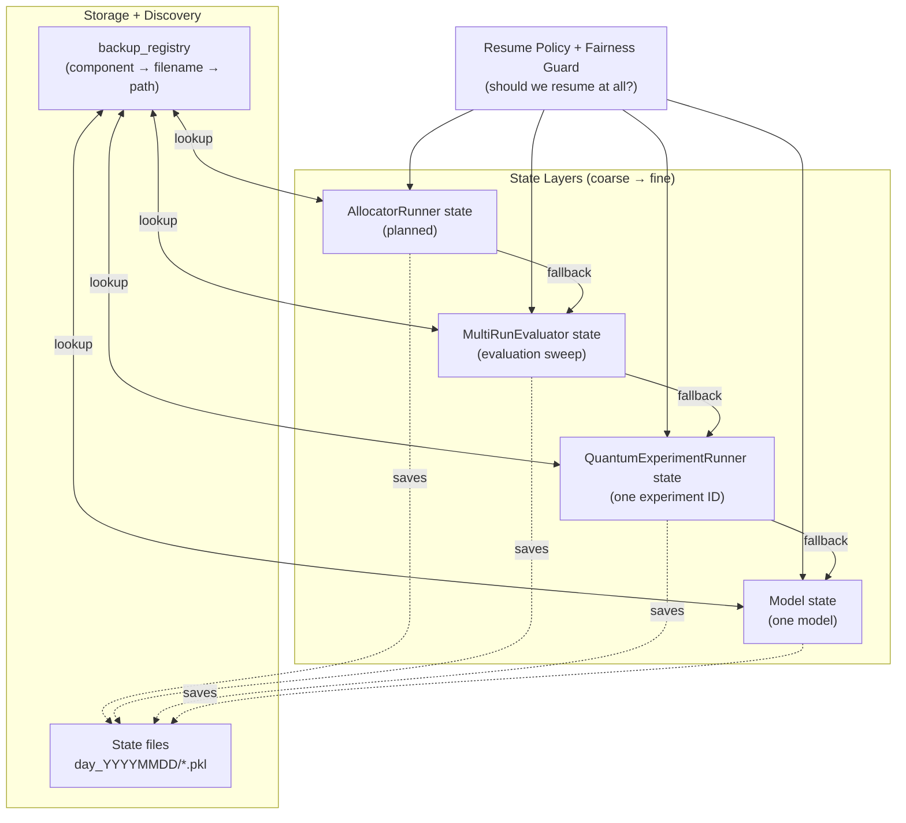

# State Layers & Resume Strategy

This framework is intentionally designed with **multiple independent state layers** so we can resume work at the right granularity after interruptions (including across days) and so downstream analysis can trust what was executed.

## Goal (why multiple layers exist)

We save state at three levels (and soon four):

1. **Model state**: resume a *single model* run.
2. **Runner state**: resume an *entire experiment* (one experiment ID / scenario) that contains multiple models.
3. **Evaluator state**: resume an *evaluation sweep* (multiple experiments/runs across scenarios).
4. **AllocatorRunner state (planned)**: resume an *allocator-level orchestration* that contains multiple evaluators and supports “whole allocator” analysis.

The idea is that if an evaluator run is interrupted, we can resume tomorrow at the **most appropriate layer**:
- Fastest path: resume evaluator/runner if compatible.
- Most granular fallback: resume individual models when the higher layers are incomplete/unavailable.

## Mental model (narrative that guides design decisions)

Use this story to sanity-check responsibilities before changing code.

- **Configuration (`configs`) = “the sun”**: shared context seen by every object, but **no single object owns it**.
- **Allocator = “a world”**: defines routing/qubit-allocation conditions; worlds differ.
- **Threat scenarios = “shared aerospace”**: the same scenario suite must be flown through every world so comparisons stay fair.
- **Evaluator = “a continent”**: evaluates and aggregates performance across its countries (experiments) under one scope (testbed/allocator/scales/scenarios/horizon).
- **Runner = “a country”**: one concrete experiment instance; it must be consistent for every worker inside it.
- **Models = “workers”**: algorithms that operate inside the same country; they must experience the **same environment instance** for fairness.

**Design question for any change (mandatory):**
> Which owner (world/continent/country/worker) should own this behavior, and what fairness contract must it preserve?

## The state layers (coarse → fine)

### 1) Model state (`model_state/…`)
- **Purpose**: Resume an individual algorithm/model (e.g., `EXPNeuralUCB`, `GNeuralUCB`, `Oracle`, etc.).
- **When used**: When runner/evaluator state is missing/incomplete, or when we want fine-grained continuation.
- **Trade-off**: This can change the semantics of a “fresh” experiment (important for fairness-sensitive studies). Sometimes we explicitly **disable** resume to avoid contaminating fairness comparisons.

### 2) Runner state (`framework_state/QuantumExperimentRunner_…`)
- **Purpose**: Resume an experiment (one experiment ID) that includes multiple models.
- **When used**:
  - Continue a partially completed experiment without rerunning completed models.
  - Reconstruct missing runner results by re-running only what’s missing.
- **Key property**: Runner-level resume is the “experiment integrity” layer.

### 3) Evaluator state (`framework_state/MultiRunEvaluator_…`)
- **Purpose**: Resume the evaluation sweep across experiments and scenarios.
- **When used**:
  - Continue long evaluations without rerunning completed experiments.
  - Recover from notebook/kernel interruptions and still produce consistent summaries/plots.
- **Key property**: Evaluator-level resume is the “study progress” layer.

### 4) AllocatorRunner state (`framework_state/AllocatorRunner_…`) — planned
- **Purpose**: Track and resume *allocator-centric orchestration*.
- **Why it matters**: This layer has access to **all evaluators run under an allocator**, which makes analysis more comprehensive and reproducible (allocator ↔ evaluator ↔ runner ↔ model).

## Resume ladder (how we should think about resuming)

At run time, resumption should behave like a ladder:

1. Try **AllocatorRunner** state (when implemented).
2. Else try **Evaluator** state.
3. Else try **Runner** state.
4. Else try **Model** state.
5. Else run fresh.

This preserves the principle: **resume as high as possible, fall back as needed**.

## Responsibility guardrails (keep code short + reusable)

- Keep “state discovery” inside the owning object (constructor/resume path + its own methods).
- Don’t duplicate filename/registry probing logic in unrelated layers.
- Treat `configs` as shared context; avoid mutations that change other objects’ intended contracts.

## Registry is the heart of resume

States live in dated folders (e.g., `day_YYYYMMDD`). To reliably discover them later, we rely on a registry mapping:
- `component` → `filename` → `absolute path`

If the registry is stale (not updated after saves), the system can behave like:
> “file exists locally, but resume can’t find it”

That’s why the registry must be **updated and persisted after each evaluator/runner/model save**, so the next run (or next day) can recover correctly.

## Fairness note (why we sometimes *don’t* resume)

Resume can be a big time-saver, but it can also change experimental semantics:
- Continuing a learned policy can bias fairness measurements vs a clean re-run.
- Some studies need strict “start-from-scratch” behavior for comparability.

So resume is a tool, not a default: **we decide per study** whether resume is allowed.

## Diagram (state hierarchy + fallback)

